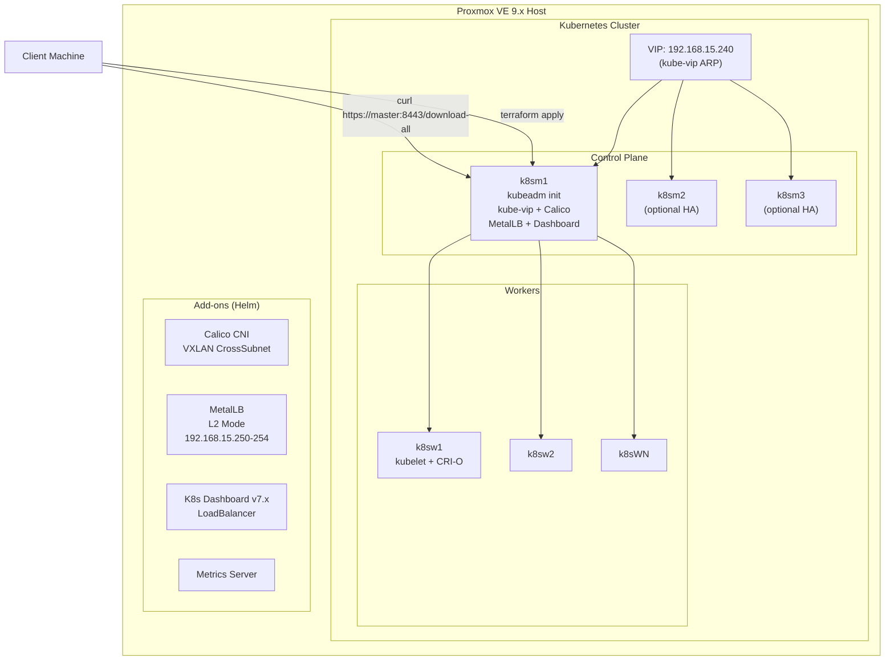
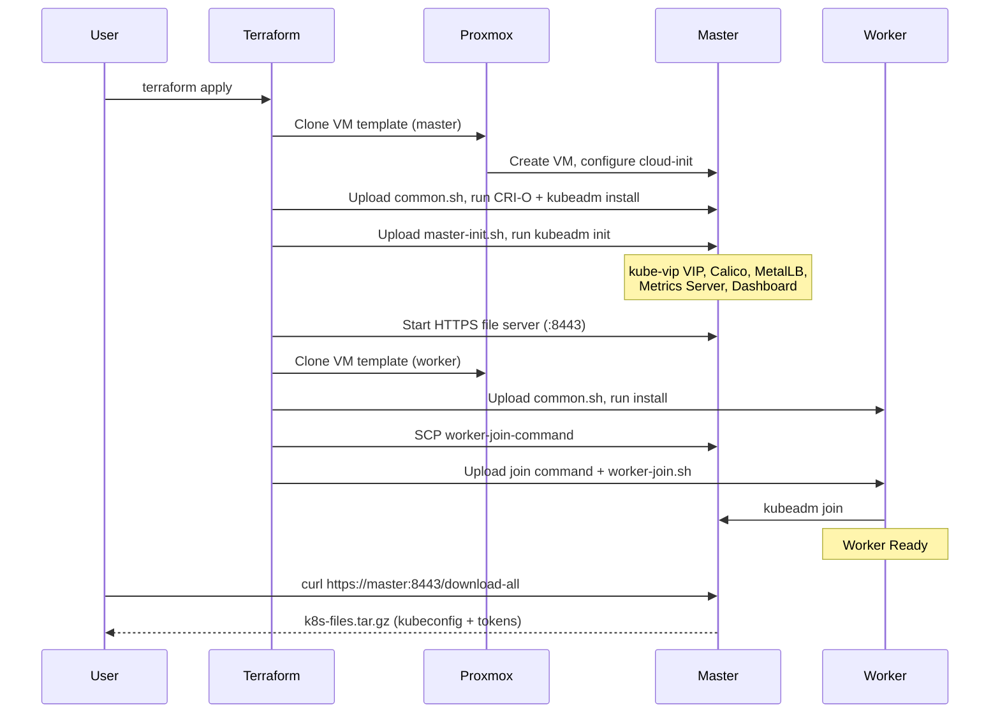

# Kubernetes on Proxmox VE - Terraform Automated Deployment

[](https://www.terraform.io/)
[](https://www.proxmox.com/)
[](https://kubernetes.io/)
[](https://ubuntu.com/)
[](LICENSE)

> [Portugues](README.pt-br.md)

Automated deployment of a production-ready, High Availability Kubernetes cluster on Proxmox VE using Terraform, CRI-O, and kubeadm. Zero-touch provisioning from VM template to fully operational cluster with Calico CNI, MetalLB, kube-vip VIP, Metrics Server, and Kubernetes Dashboard.

## Architecture



## Technology Stack

| Component | Version | Description |
|-----------|---------|-------------|
| Proxmox VE | 9.x | Hypervisor with API automation |
| Ubuntu | 24.04 LTS | Cloud-Init VM template |
| Kubernetes | v1.31 | Stable release |
| CRI | CRI-O 1.31 | Container runtime |
| CNI | Calico (Tigera Operator) | VXLAN CrossSubnet encapsulation |
| Load Balancer | MetalLB v0.14.x | L2 mode, bare-metal LB |
| HA VIP | kube-vip v1.1.2 | ARP-based virtual IP for kube-apiserver |
| Metrics | Metrics Server | Resource metrics API |
| Dashboard | Kubernetes Dashboard v7.x | Web UI with RBAC |
| IaC | Terraform >= 1.5 | Infrastructure as Code |
| Provider | bpg/proxmox >= 0.68 | Proxmox Terraform provider |
| Package Manager | Helm 3 | Kubernetes package manager |

## Prerequisites

### Proxmox VE 9.x Setup

#### 1. Create API User and Role

```bash
# Create role with minimal required privileges (Proxmox VE 9.x)
pveum role add TerraformProv -privs "Datastore.AllocateSpace Datastore.Audit Pool.Allocate Sys.Audit Sys.Console Sys.Modify VM.Allocate VM.Audit VM.Clone VM.Config.CDROM VM.Config.Cloudinit VM.Config.CPU VM.Config.Disk VM.Config.HWType VM.Config.Memory VM.Config.Network VM.Config.Options VM.Migrate VM.PowerMgmt SDN.Use"

# Create user
pveum user add terraform-prov@pve --password <YourPassword>

# Grant role at / (full access)
pveum aclmod / -user terraform-prov@pve -role TerraformProv
```

> **Note**: `VM.Monitor` is not included in Proxmox VE 9.x. The privilege list above is the minimum required for Terraform VM provisioning.

#### 2. Create Ubuntu 24.04 Cloud-Init Template

```bash
# On Proxmox host:
wget https://cloud-images.ubuntu.com/noble/current/noble-server-cloudimg-amd64.img
apt install libguestfs-tools -y

# Customize image (install guest agent)
virt-customize -a noble-server-cloudimg-amd64.img --install qemu-guest-agent
virt-customize -a noble-server-cloudimg-amd64.img --run-command "apt update -y && apt upgrade -y"

# Create VM
qm create 9000 --name "ubuntu2404-template" --memory 2048 --cores 1 --net0 virtio,bridge=vmbr0
qm set 9000 --scsi0 local-lvm:0,import-from=/root/noble-server-cloudimg-amd64.img
qm set 9000 --ide3 local-lvm:cloudinit
qm set 9000 --boot order=scsi0
qm set 9000 --serial0 socket --vga serial0

# Convert to template
qm template 9000
```

### Local Requirements

| Tool | Version | Purpose |
|------|---------|---------|
| Terraform | >= 1.5.0 | Infrastructure provisioning |
| SSH key pair | ed25519 recommended | Node access |
| Network | `192.168.15.0/24` | Proxmox + K8s network |

## Quick Start

### 1. Clone and Configure

```bash
git clone https://github.com/LeandroSalvas/deploy-k8s-terraform-proxmox.git
cd deploy-k8s-terraform-proxmox/terraform-k8s-proxmox

cp terraform.tfvars.example terraform.tfvars
# Edit terraform.tfvars with your Proxmox host, IPs, and network settings
```

### 2. Set Credentials

```bash
export TF_VAR_pmox_password="your-proxmox-password"
export TF_VAR_ssh_public_key="$(cat ~/.ssh/id_ed25519.pub)"
```

### 3. Deploy

```bash
export PATH="$HOME/.local/bin:$PATH"

terraform init
terraform plan -out=tfplan
terraform apply tfplan
```

### 4. Access the Cluster

After `terraform apply` completes, download the kubeconfig and tokens from the HTTPS file server:

```bash
curl --insecure https://192.168.15.221:8443/download-all -o k8s-files.tar.gz
tar xzf k8s-files.tar.gz
export KUBECONFIG=$(pwd)/kubeconfig
kubectl get nodes
```

## Variables Reference

| Variable | Type | Default | Description |
|----------|------|---------|-------------|
| `pmox_api_url` | `string` | — | Proxmox API URL (e.g., `https://host:8006/api2/json`) |
| `pmox_user` | `string` | `terraform-prov@pve` | Proxmox authentication user |
| `pmox_password` | `string` | — | Proxmox password (set via `TF_VAR_pmox_password`) |
| `ssh_public_key` | `string` | — | SSH public key for cloud-init |
| `ssh_private_key_path` | `string` | `~/.ssh/id_rsa` | Path to SSH private key |
| `template_name` | `string` | `ubuntu2404-template` | Proxmox VM template name |
| `k8s_version` | `string` | `v1.31` | Kubernetes version (format: `v1.XX`) |
| `vip_address` | `string` | — | Virtual IP for kube-apiserver HA |
| `pod_cidr` | `string` | `10.244.0.0/16` | Pod network CIDR |
| `service_cidr` | `string` | `10.96.0.0/12` | Service network CIDR |
| `k8s_masters` | `map(object)` | — | Control plane node configurations |
| `k8s_workers` | `map(object)` | — | Worker node configurations |
| `metallb_ip_pool` | `string` | — | MetalLB IP range (e.g., `192.168.15.250-192.168.15.254`) |

### Node Object Schema

Each entry in `k8s_masters` and `k8s_workers`:

```hcl
{
  target_node = "pve"        # Proxmox node name
  vcpu        = 2             # CPU cores
  memory      = 4096          # RAM in MB
  disk_size   = 30            # Disk in GB
  name        = "k8sm1"       # VM hostname
  notes       = "CP Node 1"   # VM description
  ip          = "192.168.15.221"  # Static IP
  gw          = "192.168.15.1"    # Gateway
}
```

## Accessing the Cluster

### Method 1: HTTPS File Server (Recommended)

After deployment, a self-signed HTTPS server runs on port **8443** of the first master. It serves the kubeconfig, dashboard token, and worker join command.

```bash
# Download all files at once (server auto-shutdowns after this)
curl --insecure https://<master-ip>:8443/download-all -o k8s-files.tar.gz
tar xzf k8s-files.tar.gz
# Files: kubeconfig, dashboard-token.txt, worker-join-command.txt
```

```bash
# Or browse for individual files
https://<master-ip>:8443/                  # File listing
https://<master-ip>:8443/kubeconfig        # Download kubeconfig
https://<master-ip>:8443/dashboard-token.txt
```

> **Security**: The server uses a self-signed certificate. Use `--insecure` with curl or accept the browser warning. The server auto-shutdowns after the `/download-all` endpoint is hit.

### Method 2: SCP

```bash
scp root@<master-ip>:/etc/kubernetes/admin.conf ~/.kube/config
```

### Method 3: kubectl (if already configured)

```bash
kubectl get nodes
kubectl get pods -A
```

## Add-ons & Stack

All add-ons are installed automatically during `terraform apply` on the first control plane node.

### CNI - Calico (Tigera Operator)

Calico is installed via the Tigera Operator Helm chart with VXLAN CrossSubnet encapsulation.

```bash
# Verify Calico
kubectl get pods -n calico-system
kubectl get ippool -n calico-system
```

**Configuration**: Pod CIDR is configured via `pod_cidr` variable. VXLAN CrossSubnet mode is used for cross-subnet encapsulation.

### Load Balancer - MetalLB (L2 Mode)

MetalLB provides bare-metal LoadBalancer services via L2 advertisement.

```bash
# Verify MetalLB
kubectl get pods -n metallb-system
kubectl get ipaddresspool -n metallb-system
```

**IP Pool**: Configured via `metallb_ip_pool` variable (default: `192.168.15.250-192.168.15.254`).

**Usage**: Set `type: LoadBalancer` on any Service to get an external IP from the pool:

```yaml
apiVersion: v1
kind: Service
metadata:
  name: my-app
spec:
  type: LoadBalancer
  ports:
    - port: 80
      targetPort: 8080
```

### Metrics Server

Provides resource metrics API (`kubectl top nodes`, `kubectl top pods`).

```bash
# Verify
kubectl top nodes
kubectl top pods -A
```

### Kubernetes Dashboard v7.x

Web-based UI for cluster management. Exposed via MetalLB LoadBalancer.

```bash
# Get Dashboard URL
kubectl get svc kubernetes-dashboard-kong-proxy -n kubernetes-dashboard

# Generate login token
kubectl create token admin-user -n kubernetes-dashboard --duration=8760h
```

**RBAC**: An `admin-user` ServiceAccount with `cluster-admin` binding is created automatically. Use the generated token to log in at `https://<metallb-ip>`.

## Scaling

### Add Workers

Edit `terraform.tfvars` and add entries to `k8s_workers`:

```hcl
k8s_workers = {
  w1 = { target_node = "pve", vcpu = 4, memory = 4096, disk_size = 30, name = "k8sw1", notes = "Worker 1", ip = "192.168.15.222", gw = "192.168.15.1" }
  w2 = { target_node = "pve", vcpu = 4, memory = 4096, disk_size = 30, name = "k8sw2", notes = "Worker 2", ip = "192.168.15.232", gw = "192.168.15.1" }
}
```

Then run `terraform apply`.

### Add Control Plane Nodes

Edit `terraform.tfvars` and add to `k8s_masters`:

```hcl
k8s_masters = {
  m1 = { ... }
  m2 = { target_node = "pve", vcpu = 2, memory = 4096, disk_size = 30, name = "k8sm2", notes = "Control Plane 2", ip = "192.168.15.222", gw = "192.168.15.1" }
  m3 = { target_node = "pve", vcpu = 2, memory = 4096, disk_size = 30, name = "k8sm3", notes = "Control Plane 3", ip = "192.168.15.223", gw = "192.168.15.1" }
}
```

> **Note**: Use odd numbers of control planes (1, 3, 5) for etcd quorum.

## Repository Structure

```
deploy-k8s-terraform-proxmox/
├── README.md                          # This file
├── README.pt-br.md                    # Portugues documentation
├── LICENSE                            # MIT License
├── .gitignore                         # Git ignore rules
├── app_mario/
│   └── app.yml                        # Demo application (Super Mario)
├── metallb/
│   ├── metallb-ip-pool.yml            # MetalLB IPAddressPool manifest
│   └── metallb-pool-advertise.yml     # MetalLB L2Advertisement manifest
├── scripts/
│   └── validate-cluster.sh            # Post-deploy cluster validation
└── terraform-k8s-proxmox/
    ├── main.tf                        # Root module - provider + module call
    ├── variables.tf                   # Root variables with validation
    ├── outputs.tf                     # Root outputs (VIP, kubeconfig cmd)
    ├── terraform.tfvars               # Your values (git-ignored)
    ├── terraform.tfvars.example       # Template for variables
    ├── modules/
    │   └── k8s-cluster/
    │       ├── main.tf                # VM resources + bootstrap provisioners
    │       ├── variables.tf           # Module inputs
    │       └── outputs.tf             # Module outputs
    ├── templates/
    │   ├── scripts/
    │   │   ├── common.sh              # CRI-O + kubeadm + Helm install
    │   │   ├── master-init.sh         # kubeadm init + all add-ons
    │   │   ├── master-join.sh         # Additional control plane join
    │   │   └── worker-join.sh         # Worker node join
    │   └── cloud-init/
    │       ├── master-init.yaml.tpl   # Master cloud-init template
    │       └── worker-init.yaml.tpl   # Worker cloud-init template
    ├── scripts/
    │   └── configure-cloudinit.sh     # Cloud-init API configuration
    ├── manifests/
    │   └── metallb-config.yaml        # MetalLB config manifest
    └── ssh-keys/
        └── .gitkeep                   # Place SSH keys here (git-ignored)
```

## Deployment Flow



## Security

- **No hardcoded secrets**: Credentials via `TF_VAR_*` environment variables only
- **SSH key-based auth**: No password authentication for node access
- **Cloud-init tokens**: Expire after 24h, single-use
- **Minimal RBAC**: Terraform user gets only required Proxmox privileges
- **Dashboard RBAC**: `admin-user` ServiceAccount with explicit `cluster-admin` binding
- **HTTPS file server**: Self-signed certificate, auto-shutdown after download
- **`.gitignore` coverage**: `*.tfstate`, `*.tfvars`, `ssh-keys/*`, `*.env`, IDE files

```bash
# Verify no secrets in repo
git ls-files | xargs grep -l "password\|secret\|token" --include="*.tf" --include="*.sh" 2>/dev/null || echo "Clean"
```

## Validation

After deployment, run the validation script:

```bash
./scripts/validate-cluster.sh
```

This checks: nodes Ready, control-plane pods, Calico, MetalLB, Metrics Server, and DNS resolution.

## Cleanup

```bash
cd terraform-k8s-proxmox
terraform destroy
```

## Contributing

Contributions are welcome! Please open an issue or submit a pull request.

1. Fork the repository
2. Create a feature branch (`git checkout -b feature/amazing-feature`)
3. Commit your changes (`git commit -m 'Add amazing feature'`)
4. Push to the branch (`git push origin feature/amazing-feature`)
5. Open a Pull Request

## License

This project is licensed under the MIT License - see the [LICENSE](LICENSE) file for details.
