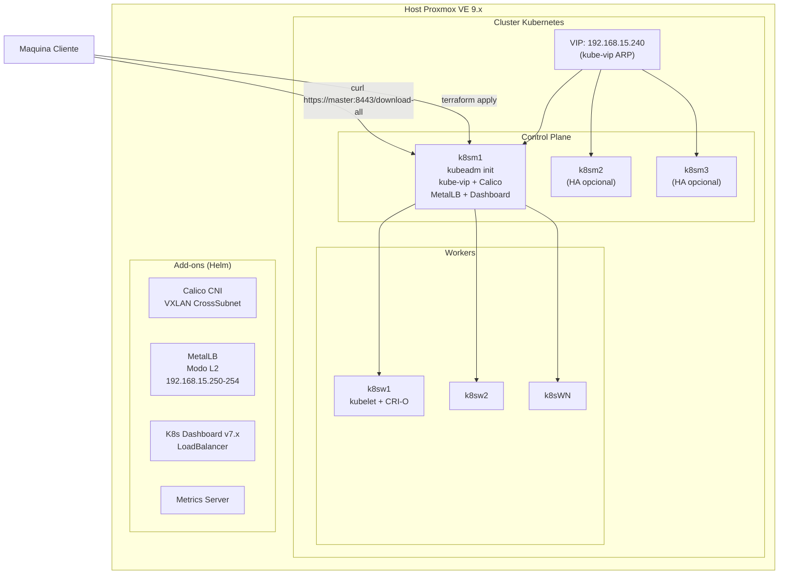
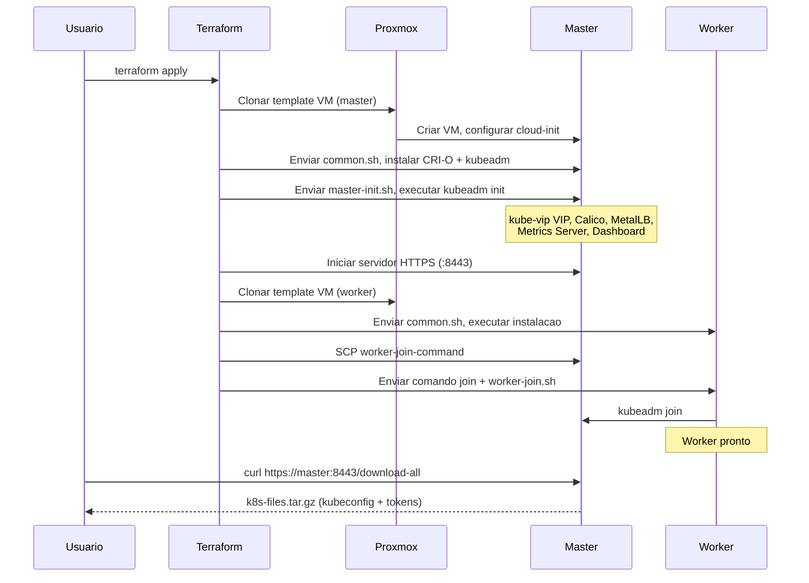

# Kubernetes no Proxmox VE - Deploy Automatizado com Terraform

[](https://www.terraform.io/)
[](https://www.proxmox.com/)
[](https://kubernetes.io/)
[](https://ubuntu.com/)
[](LICENSE)

> [English](README.md)

Deploy automatizado de um cluster Kubernetes de alta disponibilidade pronto para producao no Proxmox VE usando Terraform, CRI-O e kubeadm. Provisionamento zero-touch a partir de template VM ate cluster totalmente operacional com Calico CNI, MetalLB, VIP kube-vip, Metrics Server e Kubernetes Dashboard.

## Arquitetura



## Stack Tecnologica

| Componente | Versao | Descricao |
|------------|--------|-----------|
| Proxmox VE | 9.x | Hipervisor com automacao via API |
| Ubuntu | 24.04 LTS | Template VM com Cloud-Init |
| Kubernetes | v1.31 | Release estavel |
| CRI | CRI-O 1.31 | Runtime de containers |
| CNI | Calico (Tigera Operator) | Encapsulamento VXLAN CrossSubnet |
| Load Balancer | MetalLB v0.14.x | Modo L2, LB bare-metal |
| HA VIP | kube-vip v1.1.2 | VIP via ARP para kube-apiserver |
| Metrics | Metrics Server | API de metricas de recursos |
| Dashboard | Kubernetes Dashboard v7.x | Web UI com RBAC |
| IaC | Terraform >= 1.5 | Infraestrutura como Codigo |
| Provider | bpg/proxmox >= 0.68 | Provider Terraform para Proxmox |
| Gerenciador | Helm 3 | Gerenciador de pacotes Kubernetes |

## Pre-requisitos

### Configuracao do Proxmox VE 9.x

#### 1. Criar Usuario API e Perfil

```bash
# Criar perfil com privilegios minimos necessarios (Proxmox VE 9.x)
pveum role add TerraformProv -privs "Datastore.AllocateSpace Datastore.Audit Pool.Allocate Sys.Audit Sys.Console Sys.Modify VM.Allocate VM.Audit VM.Clone VM.Config.CDROM VM.Config.Cloudinit VM.Config.CPU VM.Config.Disk VM.Config.HWType VM.Config.Memory VM.Config.Network VM.Config.Options VM.Migrate VM.PowerMgmt SDN.Use"

# Criar usuario
pveum user add terraform-prov@pve --password <SuaSenha>

# Conceder perfil em / (acesso total)
pveum aclmod / -user terraform-prov@pve -role TerraformProv
```

> **Nota**: `VM.Monitor` nao esta incluido no Proxmox VE 9.x. A lista de privilegios acima e o minimo necessario para provisioning de VMs via Terraform.

#### 2. Criar Template Ubuntu 24.04 com Cloud-Init

```bash
# No host Proxmox:
wget https://cloud-images.ubuntu.com/noble/current/noble-server-cloudimg-amd64.img
apt install libguestfs-tools -y

# Personalizar imagem (instalar agente guest)
virt-customize -a noble-server-cloudimg-amd64.img --install qemu-guest-agent
virt-customize -a noble-server-cloudimg-amd64.img --run-command "apt update -y && apt upgrade -y"

# Criar VM
qm create 9000 --name "ubuntu2404-template" --memory 2048 --cores 1 --net0 virtio,bridge=vmbr0
qm set 9000 --scsi0 local-lvm:0,import-from=/root/noble-server-cloudimg-amd64.img
qm set 9000 --ide3 local-lvm:cloudinit
qm set 9000 --boot order=scsi0
qm set 9000 --serial0 socket --vga serial0

# Converter em template
qm template 9000
```

### Requisitos Locais

| Ferramenta | Versao | Finalidade |
|------------|--------|------------|
| Terraform | >= 1.5.0 | Provisionamento de infraestrutura |
| Par de chaves SSH | ed25519 recomendado | Acesso aos nos |
| Rede | `192.168.15.0/24` | Rede Proxmox + K8s |

## Inicio Rapido

### 1. Clonar e Configurar

```bash
git clone https://github.com/LeandroSalvas/deploy-k8s-terraform-proxmox.git
cd deploy-k8s-terraform-proxmox/terraform-k8s-proxmox

cp terraform.tfvars.example terraform.tfvars
# Edite terraform.tfvars com seu host Proxmox, IPs e configuracoes de rede
```

### 2. Definir Credenciais

```bash
export TF_VAR_pmox_password="sua-senha-proxmox"
export TF_VAR_ssh_public_key="$(cat ~/.ssh/id_ed25519.pub)"
```

### 3. Deploy

```bash
export PATH="$HOME/.local/bin:$PATH"

terraform init
terraform plan -out=tfplan
terraform apply tfplan
```

### 4. Acessar o Cluster

Apos o `terraform apply` completar, baixe o kubeconfig e tokens do servidor HTTPS:

```bash
curl --insecure https://192.168.15.221:8443/download-all -o k8s-files.tar.gz
tar xzf k8s-files.tar.gz
export KUBECONFIG=$(pwd)/kubeconfig
kubectl get nodes
```

## Referencia de Variaveis

| Variavel | Tipo | Padrao | Descricao |
|----------|------|--------|-----------|
| `pmox_api_url` | `string` | — | URL da API Proxmox (ex: `https://host:8006/api2/json`) |
| `pmox_user` | `string` | `terraform-prov@pve` | Usuario de autenticacao Proxmox |
| `pmox_password` | `string` | — | Senha Proxmox (definir via `TF_VAR_pmox_password`) |
| `ssh_public_key` | `string` | — | Chave publica SSH para cloud-init |
| `ssh_private_key_path` | `string` | `~/.ssh/id_rsa` | Caminho para chave SSH privada |
| `template_name` | `string` | `ubuntu2404-template` | Nome do template VM Proxmox |
| `k8s_version` | `string` | `v1.31` | Versao do Kubernetes (formato: `v1.XX`) |
| `vip_address` | `string` | — | VIP para HA do kube-apiserver |
| `pod_cidr` | `string` | `10.244.0.0/16` | CIDR da rede de pods |
| `service_cidr` | `string` | `10.96.0.0/12` | CIDR da rede de servicos |
| `k8s_masters` | `map(object)` | — | Configuracoes dos nos control plane |
| `k8s_workers` | `map(object)` | — | Configuracoes dos nos worker |
| `metallb_ip_pool` | `string` | — | Range de IPs do MetalLB (ex: `192.168.15.250-192.168.15.254`) |

### Esquema do Objeto Node

Cada entrada em `k8s_masters` e `k8s_workers`:

```hcl
{
  target_node = "pve"        # Nome do node Proxmox
  vcpu        = 2             # Nucleos de CPU
  memory      = 4096          # RAM em MB
  disk_size   = 30            # Disco em GB
  name        = "k8sm1"       # Hostname da VM
  notes       = "CP Node 1"   # Descricao da VM
  ip          = "192.168.15.221"  # IP estatico
  gw          = "192.168.15.1"    # Gateway
}
```

## Acesso ao Cluster

### Metodo 1: Servidor HTTPS (Recomendado)

Apos o deploy, um servidor HTTPS com certificado auto-assinado roda na porta **8443** do primeiro master. Ele serve o kubeconfig, token do dashboard e comando de join dos workers.

```bash
# Baixar todos os arquivos de uma vez (servidor encerra apos isso)
curl --insecure https://<ip-master>:8443/download-all -o k8s-files.tar.gz
tar xzf k8s-files.tar.gz
# Arquivos: kubeconfig, dashboard-token.txt, worker-join-command.txt
```

```bash
# Ou navegar por arquivos individuais
https://<ip-master>:8443/                  # Listagem de arquivos
https://<ip-master>:8443/kubeconfig        # Baixar kubeconfig
https://<ip-master>:8443/dashboard-token.txt
```

> **Seguranca**: O servidor usa certificado auto-assinado. Use `--insecure` com curl ou aceite o aviso do navegador. O servidor encerra automaticamente apos o endpoint `/download-all` ser acessado.

### Metodo 2: SCP

```bash
scp root@<ip-master>:/etc/kubernetes/admin.conf ~/.kube/config
```

### Metodo 3: kubectl (se ja configurado)

```bash
kubectl get nodes
kubectl get pods -A
```

## Add-ons e Stack

Todos os add-ons sao instalados automaticamente durante o `terraform apply` no primeiro node control plane.

### CNI - Calico (Tigera Operator)

Calico e instalado via chart Helm do Tigera Operator com encapsulamento VXLAN CrossSubnet.

```bash
# Verificar Calico
kubectl get pods -n calico-system
kubectl get ippool -n calico-system
```

**Configuracao**: O CIDR dos pods e configurado via variavel `pod_cidr`. O modo VXLAN CrossSubnet e usado para encapsulamento cross-subnet.

### Load Balancer - MetalLB (Modo L2)

MetalLB fornece servicos LoadBalancer em bare-metal via anuncio L2.

```bash
# Verificar MetalLB
kubectl get pods -n metallb-system
kubectl get ipaddresspool -n metallb-system
```

**Pool de IPs**: Configurado via variavel `metallb_ip_pool` (padrao: `192.168.15.250-192.168.15.254`).

**Uso**: Defina `type: LoadBalancer` em qualquer Service para obter um IP externo do pool:

```yaml
apiVersion: v1
kind: Service
metadata:
  name: meu-app
spec:
  type: LoadBalancer
  ports:
    - port: 80
      targetPort: 8080
```

### Metrics Server

Fornece API de metricas de recursos (`kubectl top nodes`, `kubectl top pods`).

```bash
# Verificar
kubectl top nodes
kubectl top pods -A
```

### Kubernetes Dashboard v7.x

Interface web para gerenciamento do cluster. Exposto via LoadBalancer do MetalLB.

```bash
# Obter URL do Dashboard
kubectl get svc kubernetes-dashboard-kong-proxy -n kubernetes-dashboard

# Gerar token de login
kubectl create token admin-user -n kubernetes-dashboard --duration=8760h
```

**RBAC**: Um ServiceAccount `admin-user` com binding `cluster-admin` e criado automaticamente. Use o token gerado para fazer login em `https://<ip-metallb>`.

## Escalabilidade

### Adicionar Workers

Edite `terraform.k8s-proxmox/terraform.tfvars` e adicione entradas em `k8s_workers`:

```hcl
k8s_workers = {
  w1 = { target_node = "pve", vcpu = 4, memory = 4096, disk_size = 30, name = "k8sw1", notes = "Worker 1", ip = "192.168.15.222", gw = "192.168.15.1" }
  w2 = { target_node = "pve", vcpu = 4, memory = 4096, disk_size = 30, name = "k8sw2", notes = "Worker 2", ip = "192.168.15.232", gw = "192.168.15.1" }
}
```

Execute `terraform apply`.

### Adicionar Nos Control Plane

Edite `terraform.tfvars` e adicione em `k8s_masters`:

```hcl
k8s_masters = {
  m1 = { ... }
  m2 = { target_node = "pve", vcpu = 2, memory = 4096, disk_size = 30, name = "k8sm2", notes = "Control Plane 2", ip = "192.168.15.222", gw = "192.168.15.1" }
  m3 = { target_node = "pve", vcpu = 2, memory = 4096, disk_size = 30, name = "k8sm3", notes = "Control Plane 3", ip = "192.168.15.223", gw = "192.168.15.1" }
}
```

> **Nota**: Use numeros impares de control planes (1, 3, 5) para quorum do etcd.

## Estrutura do Repositorio

```
deploy-k8s-terraform-proxmox/
├── README.md                          # Este arquivo (English)
├── README.pt-br.md                    # Documentacao em Portugues
├── LICENSE                            # Licenca MIT
├── .gitignore                         # Regras de ignoracao do Git
├── app_mario/
│   └── app.yml                        # Aplicacao demo (Super Mario)
├── metallb/
│   ├── metallb-ip-pool.yml            # Manifest IPAddressPool do MetalLB
│   └── metallb-pool-advertise.yml     # Manifest L2Advertisement do MetalLB
├── scripts/
│   └── validate-cluster.sh            # Validacao do cluster pos-deploy
└── terraform-k8s-proxmox/
    ├── main.tf                        # Modulo raiz - provider + chamada de modulo
    ├── variables.tf                   # Variaveis raiz com validacao
    ├── outputs.tf                     # Saidas raiz (VIP, comando kubeconfig)
    ├── terraform.tfvars               # Seus valores (ignorado pelo git)
    ├── terraform.tfvars.example       # Template para variaveis
    ├── modules/
    │   └── k8s-cluster/
    │       ├── main.tf                # Recursos VM + provisioners de bootstrap
    │       ├── variables.tf           # Entradas do modulo
    │       └── outputs.tf             # Saidas do modulo
    ├── templates/
    │   ├── scripts/
    │   │   ├── common.sh              # Instalacao CRI-O + kubeadm + Helm
    │   │   ├── master-init.sh         # kubeadm init + todos os add-ons
    │   │   ├── master-join.sh         # Join de control planes adicionais
    │   │   └── worker-join.sh         # Join de nos worker
    │   └── cloud-init/
    │       ├── master-init.yaml.tpl   # Template cloud-init do master
    │       └── worker-init.yaml.tpl   # Template cloud-init do worker
    ├── scripts/
    │   └── configure-cloudinit.sh     # Configuracao da API cloud-init
    ├── manifests/
    │   └── metallb-config.yaml        # Manifest de configuracao do MetalLB
    └── ssh-keys/
        └── .gitkeep                   # Coloque suas chaves SSH aqui (ignorado pelo git)
```

## Fluxo de Deploy



## Seguranca

- **Sem secrets hardcoded**: Credenciais apenas via variaveis de ambiente `TF_VAR_*`
- **Autenticacao por chave SSH**: Sem autenticacao por senha para acesso aos nos
- **Tokens cloud-init**: Expiram apos 24h, uso unico
- **RBAC minimo**: Usuario Terraform recebe apenas os privilegios Proxmox necessarios
- **RBAC do Dashboard**: ServiceAccount `admin-user` com binding explicito `cluster-admin`
- **Servidor HTTPS**: Certificado auto-assinado, encerramento automatico apos download
- **Cobertura do `.gitignore`**: `*.tfstate`, `*.tfvars`, `ssh-keys/*`, `*.env`, arquivos de IDE

```bash
# Verificar se nao ha secrets no repositorio
git ls-files | xargs grep -l "password\|secret\|token" --include="*.tf" --include="*.sh" 2>/dev/null || echo "Limpo"
```

## Validacao

Apos o deploy, execute o script de validacao:

```bash
./scripts/validate-cluster.sh
```

Verifica: nodes Ready, pods do control-plane, Calico, MetalLB, Metrics Server e resolucao DNS.

## Limpeza

```bash
cd terraform-k8s-proxmox
terraform destroy
```

## Contribuicoes

Contribuicoes sao bem-vindas! Abra uma issue ou envie um pull request.

1. Fork o repositorio
2. Crie uma branch de feature (`git checkout -b feature/amazing-feature`)
3. Commit suas mudancas (`git commit -m 'Adicionar amazing feature'`)
4. Push para a branch (`git push origin feature/amazing-feature`)
5. Abra um Pull Request

## Licenca

Este projeto esta licenciado sob a Licenca MIT - veja o arquivo [LICENSE](LICENSE) para detalhes.
